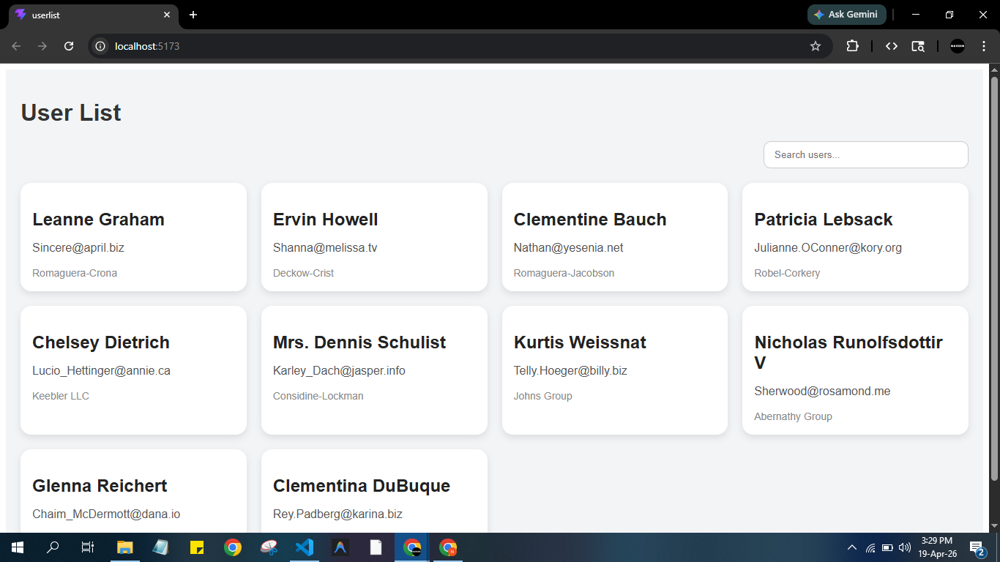
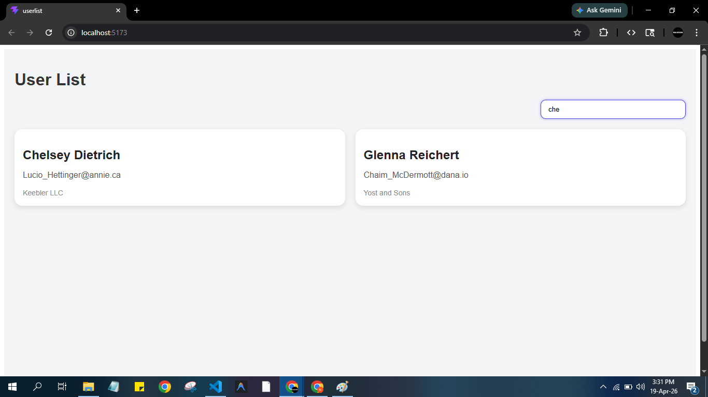

# User List Application

## Title
**User List Application with Search Filter (React + Context API)**

---

## Description
This is a simple and responsive User List application built using React. 

It fetches user data from a public API and displays it in a clean card layout.

The application includes a real-time search feature that allows users to filter users based on their name or email.

A loading indicator is shown while fetching data to enhance user experience.

---

## Tech Used
- React.js (Functional Components & Hooks)
- Context API (State Management)
- Axios (API Calls)
- CSS (Custom Styling)

---

## Screenshot

---

## Features
- Fetch user data from API
- Display users in card layout
- Top-right search filter
- Real-time filtering
- Loading spinner
- Responsive design

## Conclusion
This project demonstrates a strong foundation in React development, including API handling, state management, and UI design.

It can be improved further by adding advanced features like routing, pagination, and authentication.

## Acknowledgment
Data fetched from:

https://jsonplaceholder.typicode.com/
